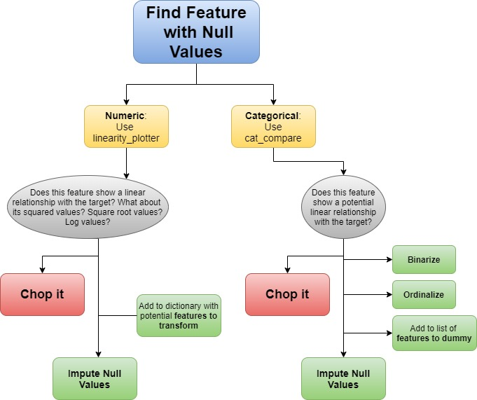
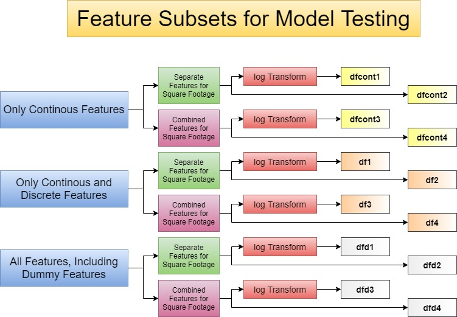

# Project 2: Predicting Housing Prices in Ames, IA
## Lee Littlejohn
#### April 10, 2020

## Goal

To model and accurately predict housing prices in Ames, IA primarily using Python's Pandas and SciKit Learn libraries with Multiple Linear Regression, and to compete with my peers in the accompanying Kaggle competition.

## Dataset Information
This project uses data collected by the Ames, Iowa Assessor's Office from 2006 to 2010, described in great detail by Dean De Cock at Truman State University.
His detailed documentation can be found [here](http://jse.amstat.org/v19n3/decock/DataDocumentation.txt).

## Data Cleaning and Exploratory Analysis
For this dataset, the cleaning process cycled through cleaning and exploratory analysis per feature, feature by feature. 

#### Helper Functions
I used a small selection of simple helper functions to assist with exploratory analysis by creating visualizations. All helper functions used in this project are available for inspection in this repository, in the file "little_helpers.py". These functions have been used ad nauseum in the accompanying technical notebooks.

* The function "linearity_plotter" generates four scatter plots against the target: $feature, feature^2, \sqrt{feature},$ and $\log(feature)$. This simultaneous visualization allows for quick inspection of linearity and the linearity of potential feature transforms.

* The function "cat_compare" generates a Seaborn bar chart for categorical features as well as their value counts. This output similarly allows for quick judgement.

* The function "chop" keeps a running tally of features on the "chopping_block" that do not show linearity or show extreme collinearity with another feature that has already been chosen for further analysis. This allows for easy data frame simplification, periodically removing features that require no further cleaning or analysis, because they will not be used for modeling.

* The functions "lm_tester," "lasso_tester," and "ridge_tester" run identically in structure.  These functions take as input a dataframe of feature subsets generated in the previous section, execute SciKit Learn's train_test_split, build a model, and return the $R^2$ scores for both the training split and the testing split, as well as the $RMSE$. These functions all also return a distribution histogram of the errors in order to continuously check the models' adherence to the Normality of Errors assumption required for MLR.

* The function "submission_gen_lm_tester" generates rapid-fire contest submissions built from Linear Regression models.

#### NULL Values

Many null values were found to be due to a lack of physical presence on the property (row) in question: for example, any property without a garage would have null values for any garage related feature. If these features were numeric, the null values were changed to the number zero. If categorical, frequently a new value would need to be created, such as "noG" (no garage).

Some null values were typos that needed to be imputed with intuition; some were reasonably filled with a measure of center derived from the feature.

Four particularly egregious outliers (oversized properties) were removed from the dataset. All non-residential properties were treated like outliers and also removed.
This diagram highlights the flow for cleaning and preliminary analysis for this dataset.

Before moving on to further feature engineering and model testing, features on the chopping block were removed from the data for simplification.

### Feature Engineering

After the cyclical data cleaning process, remaining feature engineering consisted of the following:
* Analysis of distribution histograms for all features, seeking the most normal distributions possible
* Modifying features flagged in the cleaning cycle as worthy of a logarithmic or exponential transform
* Creating dummy variables for remaining categorical features

### Model Testing

Before testing models, the remaining features were separated into subsets in new dataframes for ease of plugging in to models iteratively. The following diagram illustrates the feature stratification.

The creation of these dataframe subsets made the use of the final helper functions straitforward. Each dataframe was used to build a series of each model, MLR, Lasso, and Ridge. These models performed very similarly, generating $R^2$ scores between $.83$ and $.89$, with a difference between training and testing data of less than $.03$, suggesting that all 48 models were well fit.

The dataframe subsets that generated the marginally better performing models ended in 1 and 3, corresponding to subsets that had both separate and combined features for square footage and subsets that had undergone logarithmic transformations.

Using the Lasso, Ridge, and GridSearchCV capabilities of SciKit Learn had no consistent effect of improving model performance, since the models were generally well fit. An attempt to transform the target variable was made, but it produced extreme heteroscedasticity in the errors so that technique could not be utilized.

### Best Model

Despite Lasso, Ridge, and using GridSearchCV, the consistently best performing model was good, old fashioned MLR used on the dfd3 subset of features. This model generated a training $R^2$ of 0.8856, a testing $R^2$ of 0.8713, and an $RMSE$ of 25,526.63.

The most impactful features in this model are shown with their Beta coefficients below.

|Positive Coefficients||Negative Coefficients||
|---|---|---|---|
|totalSF|43404.687622|Total Bsmt SF|-16660.023831|
|Mas Vnr Type_BrkFace|12484.237821|Neighborhood_OldTown|-4102.336901|
|Mas Vnr Type_None|12274.945008|Garage Finish_2|-3575.769095|
|Exter Qual|10953.857965|Garage Finish_1|-2459.419923|
|Overall Goodness|10474.581937|Neighborhood_CollgCr|-2430.081991|

#### What I Know Now

After this project I can safely say I know the dangers of such granular data cleaning and feature engineering/selection. The Law of Diminishing Returns applies here.

#### Resources
This project was made possible by the detailed documentation for the SciKit Learn libraries, located [here](https://scikit-learn.org/stable/index.html), and the 2nd Chapter of "Feature Engineering for Machine Learning" by Alice Zheng & Amanda Casari